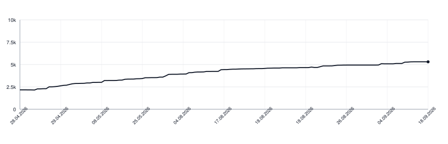

# stratum

[](https://github.com/wikilayer/stratum/actions/workflows/ci.yml)
[](https://pkg.go.dev/github.com/wikilayer/stratum)

[→ Live design-system reference](https://wikilayer.github.io/stratum/)

**A minimal CSS framework designed to embed into Go projects.**

Tokens, a layered cascade, reusable components, an icon sprite, and a handful of tiny vanilla-JS helpers — vendored as a single Go module. A Go server gets a styled UI by importing the package, mounting one `fs.FS`, and linking one stylesheet. No npm, no build step, no preprocessor.

Native CSS Custom Properties + `@layer` + a sprinkle of `color-mix()`. Works in any browser that ships `@layer` (Chrome 99 / Firefox 97 / Safari 15.4 — 2022+).

## Why it exists

Most CSS frameworks are either heavy (Bootstrap, Tailwind — with their own toolchain) or drop-in single-stylesheet kits (Pico, Simple.css) that stop short of components. Stratum sits in between: small components, tokens, and utilities, sized for an internal app or a side-project where shipping a Node toolchain alongside a single Go binary is wrong. The design-system page is the spec — if you can't build a new page out of what's documented there, the answer is to add a primitive, not a page-specific class.

## Install (Go)

```go
import "github.com/wikilayer/stratum"
```

Pin a version — `go get github.com/wikilayer/stratum@v0.4.2`. Before 1.0 a release may rename or remove a class; [CHANGELOG.md](CHANGELOG.md) names the markup to change each time.

Mount the static FS under `/static/` (use it directly, or layer your own files on top via `fs.FS` composition):

```go
http.Handle("/static/*", http.StripPrefix("/static/",
    http.FileServer(http.FS(stratum.Static))))
```

Link from your base template:

```html
<link rel="stylesheet" href="/static/stratum.css">
<script src="/static/stratum.js" defer></script>
```

That's it. Everything else is plain HTML + classes. `stratum.css` is assembled and minified in memory when the Go package initializes, so it contains no `@import` fan-out. `stratum.js` does the same for the independent browser helpers. A narrow page may still link an individual minified helper such as `theme.js` instead.

## Cascade order (`@layer`)

```
reset → tokens → base → layout → components → utilities
```

Declared in `static/stratum.css`. Every rule in the framework is wrapped in its layer. Layers later in the list win in the cascade — so utilities can always override a component, components can always override base typography, and so on.

## Tokens

All colours, spacing, radii, type sizes, shadows, durations live in `static/css/base/tokens.css` as CSS variables. There's a light default and a `html[data-theme="dark"]` override; `prefers-color-scheme: dark` falls through to the same dark values when no theme is explicitly chosen.

Hardcoding a hex inside a component is a smell. Add a token first.

Highlights:

| Variable                    | Meaning                                |
|-----------------------------|----------------------------------------|
| `--bg`, `--bg-elevated`, `--bg-subtle`, `--bg-hover`, `--bg-active` | Surface levels |
| `--fg`, `--fg-muted`, `--fg-subtle`, `--fg-on-accent` | Text levels |
| `--border`, `--border-muted` | Two contrast levels for separators |
| `--accent`, `--accent-hover`, `--accent-bg` | Brand accent colour set |
| `--danger*`, `--success-*`, `--callout-*` | Semantic colour roles |
| `--text-xs … --text-4xl` | Type scale (1.25 ratio, body 17px) |
| `--space-1 … --space-8` | 4-step spacing scale, in `rem` |
| `--radius-sm/md/lg/pill` | Corner radii |
| `--header-h`, `--aside-w`, `--content-max`, `--measure-prose`, `--measure-form` | Page-shell sizes, and the two line lengths content is capped at: running text, and a column of controls |
| `--duration-fast`, `--easing-out` | Motion |

## Base layer

Sits above tokens, below components. Three files:

- `reset.css` — `box-sizing: border-box`, zero default margins on text blocks, `font: inherit` on form controls, `display: block` on media. Nothing more.
- `typography.css` — body font, six heading levels with a 1.25-ratio scale, paragraphs with bottom margin, `<code>`/`<pre>`/`<blockquote>`. Headings are clean by default; opt into the Wikipedia / MDN baseline rule per element with `.h-rule`, or globally inside an `<article>`.
- `layout.css` — page chrome (sticky `body > header`, `.brand`, `.content` frame, optional `<aside>` rail). Plus reusable column primitives (`.column*`) and `.split` for two-column pages.

## Layout primitives

### `.column`, `.column-narrow`, `.column-wide`

Reading-width columns, centred. Pick one when a page wants to constrain its content to a single readable line.

```html
<section class="column-narrow">…</section>     <!-- --measure-form, 32em — auth, dialogs -->
<section class="column">…</section>             <!-- 38em — onboarding, prose -->
<article class="column-wide">…</article>        <!-- --measure-prose, 42em — legal docs -->
```

### `.split`, `.split-main`, `.split-side`, `.split-side-first`

Two columns: the content, and a fixed-width side for whatever stands beside it — a picture of what a form edits, a profile beside a list. Set `--side-w` to change that width (default `14rem`); add `.split-side-first` to put the side on the leading edge. Below 720px it becomes one stack with the side on top, whichever edge it sat on. Cap the main column's line length with `.measure` where it holds a form.

```html
<form class="split">
  <div class="split-main measure">…</div>
  <div class="split-side">…</div>
</form>
```

### `.page-head-row`

The page's own head, above both columns: its title and the strip of views. The sidebar holds what is about the page, so it has to begin under that strip; starting level with the title makes it read as a column of the whole site standing beside the page. Same width and inner edge as the content below, and it pulls every column's top padding in so the head's own spacing is not doubled and both columns start on the same line.

```html
<div class="page-head-row">
  <h1>Page title</h1>
  <nav class="nav-tabs">…</nav>
</div>
<div class="content">
  <main>…</main>
  <aside>…</aside>
</div>
```

### `.content-with-head`

A three-column content frame where the left navigation belongs to the whole
surface, while the page head belongs to the main and right columns. The left
rail spans both rows; the right rail begins below the page head. Without an
`<aside>`, `<main>` takes both columns. Below 720px the frame becomes one stack.

```html
<div class="content content-with-head">
  <nav class="leftnav">…whole-surface navigation…</nav>
  <div class="page-head-row">…page title and views…</div>
  <main>…page content…</main>
  <aside>…things about this page…</aside>
</div>
```

### `.bar-main`

A group inside `body > header` that ends where the main column ends, so a control pushed to its end (`.push-end`) lines up with the sidebar's edge rather than floating over the text. The bar itself already shares the content column's outer and inner edges, so the brand sits over the page title.

```html
<header>
  <div class="cluster nowrap bar-main">
    <nav class="breadcrumb">…</nav>
    <form role="search" class="push-end">…</form>
  </div>
  <div class="cluster">…the reader's own controls…</div>
</header>
```

### `nav.leftnav`

Sticky left rail next to `<main>`, mirror of the right `<aside>` rail. Use for dashboard navigation, section links, anything always-visible left of the content. Stacks above main on mobile. `.rail-section` works inside either rail.

```html
<div class="content">
  <nav class="leftnav">
    <section class="rail-section">
      <h3 class="eyebrow">Recent</h3>
      <ul>…</ul>
    </section>
  </nav>
  <main>…</main>
  <aside>…</aside>
</div>
```

## Components

Every component lives in its own file under `static/css/components/`. Markup conventions below.

### `.button`

```html
<a class="button button-primary"  href="…">…</a>
<a class="button button-secondary" href="…">…</a>
<a class="button button-ghost"     href="…">…</a>
<button class="button button-danger">…</button>
<a class="button button-primary button-sm" href="…">…</a>
```

Modifiers stack. Use `<a>` for navigation, `<button>` for actions. Icons go inline before the label.

`.button-block` makes a button fill its container, which is also what stacks a list of them: buttons are inline-flex by default and sit on one line, so a `.stack` of plain buttons gets no vertical rhythm.

```html
<div class="stack">
  <a class="button button-primary button-block"   href="…">Sign in with GitHub</a>
  <a class="button button-secondary button-block" href="…">Sign in with Google</a>
</div>
```

`.link-button` is an action that reads as a line of text: muted, underlined, no box. Use it where a rare action sits among prose or beside a field of metadata and a button would shout — deleting an account from its settings page, say. It stays a `<button>` because it acts rather than leads somewhere; an action styled as an `<a href>` is one a reader can open in a new tab and never reach.

```html
<dd>25 April 2026 · <button type="button" class="link-button" data-modal-open="…">Delete account</button></dd>
```

`.icon-link` is a lone control in a bar whose whole label is an icon — a gear beside the name of what it configures, a toolbar action. Not a tab: a tab belongs to a strip of alternatives and is underlined to say which of them you are in, and a single control has nothing to be one of, so `aria-current` here is said in colour and the icon never grows a line under it. Give it an `aria-label`; an icon on its own names nothing.

```html
<a class="icon-link" href="/settings" aria-label="Settings" aria-current="true">
  <svg class="icon" aria-hidden="true"><use href="/static/icons.svg#settings"/></svg>
</a>
```

### `.row`, `.field`, `.input`

Form primitives.

`.row` is a label-on-top stack. `.field` is the same but targets a single isolated field with a tighter label.

```html
<form class="stack">
  <div class="row">
    <label class="row-label" for="x">Display name</label>
    <input id="x" type="text" required>
  </div>
  <button class="button button-primary">Save</button>
</form>
```

`.row-inline-list` / `.row-inline` render a read-only `<dl>` of `Label: value` rows.

A form that wants something beside it, a picture or a preview, is a `.split` and needs no form-specific layout of its own.

Inputs / selects inside `.row` and `.field` get the framework's text-input look automatically. Custom `<select>` chevron is painted with two CSS gradients so it follows the theme.

`.input-sm` is the same field one step down in padding and type, for a bar or a toolbar whose row height is fixed.

`.input-fill` goes on the wrapper of a field that should be sized by the room it is given rather than by the browser's default width — a search box in a bar, where what sets the width is the space between the controls on either side of it. It stops growing at 24rem so it cannot swallow a wide bar.

```html
<form class="input-fill push-end" role="search" action="/search">
  <input class="input input-sm" type="search" name="q" placeholder="Search this wiki" autocomplete="off">
</form>
```

`.input-expand` is a field that costs an icon's width until someone wants it, for a bar with room for an icon but not for an input. Wrap a `<label for=>` holding the icon and the input; the label focuses the input with no script, `:focus-within` opens it, and a typed query keeps it open so a result page still shows what was asked. Give the label a `.visually-hidden` name, since an icon alone names nothing.

```html
<form class="input-expand" role="search" action="/search">
  <label for="q"><svg class="icon"><use href="/static/icons.svg#search"/></svg><span class="visually-hidden">Search</span></label>
  <input id="q" type="search" name="q" placeholder="Search" autocomplete="off">
</form>
```

### `.tabs`

Pure-CSS, radio-driven. Up to four tabs out of the box; extend the selector pairs in `tabs.css` for more.

Which tab shows is read from position, not from the ids: the Nth radio pairs with the Nth label and the Nth panel, so the ids are yours to name and a page may carry two tab groups. Panels are `<section>` and the bar is a `<div>`, which is what keeps the bar out of the panel count; a panel rendered as a `<div>` will not show.

```html
<div class="tabs">
  <input type="radio" id="login-oauth" name="my-tabs" checked>
  <input type="radio" id="login-password" name="my-tabs">
  <div class="tabs-bar" role="tablist">
    <label for="login-oauth" role="tab">First</label>
    <label for="login-password" role="tab">Second</label>
  </div>
  <section class="tab-panel" role="tabpanel">…</section>
  <section class="tab-panel" role="tabpanel">…</section>
</div>
```

### `.alert`

Inline message block. Variants: `.alert-error`, `.alert-success`. Always left-aligned (won't inherit `.text-center`). Use `.alert-success` as a one-shot banner after a redirect — same shape, no separate primitive needed.

### `.saved-note`

Confirmation of one control, beside that control: `<span class="saved-note" role="status">Saved</span>` next to the select or checkbox that changed. A page-wide `.alert-success` answers for the page, which is the wrong size and the wrong place for a setting that [saves on change](#javascript-helpers) two screens further down. Fades out on its own after a few seconds, because a note that stays reads as a state rather than as an answer to what just happened; `prefers-reduced-motion` keeps it still and visible.

### `.modal`

Dialog box on top of a backdrop. Built on the native `<dialog>` element — ESC closes, click on backdrop closes (wired by `modal.js`), focus trapped, no scroll-lock gymnastics. Three sub-zones: header / body / footer.

```html
<button class="button" data-modal-open="add-member">+ Add member</button>

<dialog id="add-member" class="modal">
  <header class="modal-header">
    <p class="modal-title">Add member</p>
    <button class="modal-close" data-modal-close aria-label="Close">×</button>
  </header>
  <div class="modal-body">…form fields…</div>
  <footer class="modal-footer">
    <button class="button" data-modal-close>Cancel</button>
    <button class="button button-primary">Add</button>
  </footer>
</dialog>
```

`data-modal-open="ID"` on any clickable opens the dialog with that id. `data-modal-close` on any clickable inside the dialog closes it. Load `/static/modal.js` once on the page.

### `.callout`

GitHub-flavoured callouts (`> [!NOTE]` rendered from markdown). Variants: `.callout-note`, `.callout-tip`, `.callout-important`, `.callout-warning`, `.callout-caution`. Wrap the title in `.callout-title` with an icon.

### `.map`, `.map-caption`

Embedded location iframe (rendered from `> [!MAP]` blockquotes in markdown). The container clips a single full-width `<iframe>` to a rounded card; an optional `.map-caption` strip sits below.

```html
<div class="map">
  <iframe src="https://maps.google.com/maps?q=51.4779,0.0015&z=15&output=embed" loading="lazy" referrerpolicy="no-referrer-when-downgrade" allowfullscreen></iframe>
  <div class="map-caption">Royal Observatory, Greenwich</div>
</div>
```

### `.card`, `.card-grid`, `.card-link`

Bordered surface for grouped content. `.card-grid` lays cards in a responsive grid. Add `.card-link` to an `<a>` that wraps the whole card — it gets the flex-row layout, link colour, and accent border on hover.

```html
<ul class="card-grid">
  <li><a class="card card-link" href="…"><svg class="icon">…</svg> Title</a></li>
</ul>
```

### `.avatar`, `.avatar-lg`

Round chip with initials, or `` for a Gravatar.

### `.tag`, `.tag-cN`, `.tag-row`

Small coloured label (a node tag, a status marker). `.tag` is the shape; `.tag-cN` (N = 0..7) picks one of 8 palette hues. The hue is the ink for text and border, the fill is a themed tint of it, so a tag stays legible in both themes with no per-tag override. Wrap a trailing cluster in `.tag-row` to sit it beside a heading.

```html
<h3>How we write code<span class="tag-row">
  <span class="tag tag-c0">for-agent</span>
  <span class="tag tag-c1">checklist</span>
</span></h3>
```

### `.url-pill`

Copy-this-code block — a `<code>` value paired with a compact `.copy-btn` (wired by `copy.js`). The name says URL because that's the canonical use, but the body is a generic `<code>` and works for any short string the user needs to paste somewhere.

```html
<div class="url-pill">
  <code>https://example.com/api</code>
  <button class="copy-btn" type="button"
          data-label-copy="Copy" data-label-copied="Copied">Copy</button>
</div>
```

### `.page-head`

A title row that draws the line under itself, so whatever shares the row sits on that line. Pair it with `.nav-tabs.nav-tabs-flush`, or with any other cluster of controls.
Controls in a nested `.nav-tabs` keep their own compact height and sit against
the shared baseline instead of stretching to the title's height.

### `.nav-tabs`, `.nav-tabs-icon`, `.nav-tabs-flush`

Links to views of one subject. `aria-current` marks the current view and is what draws the underline; nothing else has to change per view. Use `page` for a view of the page you are on and `true` for a section you are inside, such as a gear leading to settings you already have open. A tab sizes to its content, so it carries a label, an icon, or both, and a strip survives a label translated into a longer word. Given a column narrower than its tabs, the strip takes a second row rather than running off the screen. The strip also owns the space under itself, so the view it introduces does not begin on its own rule; inside `body > header` that margin is dropped, because there the strip is one control on a fixed-height row.

Add `.nav-tabs-icon` for a strip whose whole label is an icon: it squares the targets. An icon alone names nothing, so give every such tab a `title` and an `aria-label`.

Add `.nav-tabs-flush` where the strip shares a row with a heading and the row already draws the line, as in `.page-head`. Without it the strip draws its own, which is what a strip on its own row wants.

A `.menu-host` disclosure may sit in the strip alongside the links, for a view that opens a panel rather than navigating.

```html
<nav class="nav-tabs" aria-label="Views">
  <a href="/x" aria-current="page">Content</a>
  <a href="/x/history">History</a>
</nav>
```

### `.breadcrumb`

Carries no outer margin, so it sits equally well above a page body or inside a fixed-height bar where a bottom margin would push it off centre. Whatever places it owns the spacing.

A flex row of its own with a tight gap: the separator is a hairline between two names, not a word, and a trail set with word-wide gaps reads as a row of unrelated links. The links inherit their colour instead of setting one, so the place the trail sits decides how loudly it speaks — the bar reads its trail at full strength (`body > header .breadcrumb`), while the same trail labelling a row in a list stays out of the way of the row's own name. A `.brand` inside a trail takes the trail's size and keeps only its weight; a line whose parts differ in size jumps in height as the eye runs along it.

```html
<nav class="breadcrumb">
  <a href="/">home</a><span class="sep">/</span>
  <a href="/x">Section</a><span class="sep">/</span>
  <span class="current">Current</span>
</nav>
```

### `.menu-host`, `.menu-toggle`, `.dropdown`

Click-to-reveal menu built on `<details>`. The header avatar dropdown is the canonical use; the panel inside hosts `.dropdown .item` rows and optional `.dropdown-section` blocks.

Items line up with the section labels above them. Add `.dropdown-choice` to the panel when the menu is a set of mutually exclusive choices with one of them current (the language being read, the role a member holds): it reserves room for the check-mark on every item, so marking one does not shift its label. A plain list of links takes no such indent.

A panel calling itself `role="menu"` promises a shape a screen reader reads by: give every item a role of its own. An item that picks one of a set is `role="menuitemradio"`, and says which is current with `aria-checked="true"` — the check-mark is drawn from that attribute, so it is what marks the choice rather than a class. Write `aria-checked="false"` on the rest: without it a reader hears that the item is selectable and never that it is not selected. An item that does something is `role="menuitem"`. `aria-current` belongs to a link saying which view you are on, not to a choice in a menu.

A choice panel often ends with an item that does something rather than picking something: remove, hand over, sign out. Give such an item a leading `.icon` and it takes the column the check-mark would have, so both kinds line up down one edge. Set the two runs apart with `.dropdown-separator`, a plain rule — `.dropdown-section` pads its contents, which insets an item away from the edge it is meant to span.

The toggle's disclosure arrow is the sprite's `chevron-down` at icon size, the same mark a collapsible sidebar section uses, so the two read as one language on a screen that shows both.

```html
<details class="menu-host">
  <summary class="menu-toggle">
    Русский
    <svg class="icon" aria-hidden="true"><use href="/static/icons.svg#chevron-down"/></svg>
  </summary>
  <div class="dropdown dropdown-choice" role="menu">
    <button class="item" role="menuitemradio" aria-checked="true">Editor</button>
    <button class="item" role="menuitemradio" aria-checked="false">Viewer</button>
    <div class="dropdown-separator" role="separator"></div>
    <button class="item" role="menuitem">
      <svg class="icon" aria-hidden="true"><use href="/static/icons.svg#trash-2"/></svg>
      Remove
    </button>
    <div class="dropdown-section">
      <div class="label">Theme</div>
      <div class="segmented">…</div>
    </div>
  </div>
</details>
```

### `.segmented`

Horizontal radio-style picker (button-group). Use `aria-pressed="true"` to mark the active option.

### `.switch`

Labelled on/off toggle. A native `<input type="checkbox">` carries the state and keyboard handling; `.switch-track` and `.switch-thumb` are its skin. The `.switch-label` comes first in source order so it renders left of the track, keeping the value clear of a tapping thumb. Works with no JavaScript; the checkbox is the state. Add `checked`/`disabled` to the input as usual.

```html
<label class="switch">
  <span class="switch-label">Public link</span>
  <input type="checkbox" class="switch-input" checked>
  <span class="switch-track"><span class="switch-thumb"></span></span>
</label>
```

Canonical composition: drop a `.switch` and a `.url-pill` into a `.dropdown` under a share-icon `.menu-toggle` to build a reveal-a-link share panel (see the design-system reference).

### `.feed`, `.feed-item`, `.feed-time`, `.feed-actor`, `.feed-action`, `.feed-target`

Flat list of timestamped activity entries. `.feed-action` carries a coloured tag saying what the entry did: `.feed-action-add`, `.feed-action-edit`, `.feed-action-remove`. Map your own verbs onto those three; the words the reader sees are yours, the colours are what the three mean. `.feed-target-gone` strikes through a target whose object no longer exists.

### `.data-table`, `.meta`

Generic admin / settings table. `.meta` is the same idea but for a `<dl>` of read-only `Label: value` facts.

### `.scroll-x`

Wrapper for content that cannot be made narrower than its column, a wide table above all. Without it the child overflows its flex column and paints over whatever sits beside it, typically the page rail.

```html
<div class="scroll-x">
  <table>…</table>
</div>
```

The box scrolls sideways on its own; the page never does. Where the browser supports scroll-driven animation, the right edge fades while there is more to scroll and sharpens once the end is reached, so the fade never advertises columns that aren't there. Elsewhere the scrollbar and the cut-off column carry that message alone.

### `.sticky-lead`, `.sticky-lead-2`

Modifiers on a `<table>` inside a `.scroll-x`: the lead column stays pinned while the rest scrolls sideways, so a row keeps its label when the reader is five columns deep. Add `.sticky-lead-2` as well when the first column is a row number: a bare number doesn't say which row it is, so the second column pins too, and the number column takes the fixed `--lead-w` width the second one sticks against.

```html
<div class="scroll-x">
  <table class="sticky-lead sticky-lead-2">…</table>
</div>
```

Pinned cells paint an opaque fill because a transparent one would let the scrolled content read through: `--row-fill` if the row declares one (that is how `article table` carries its header and zebra shading), `--bg` otherwise. The table also switches to separated borders: a collapsed border belongs to the table rather than the cell, so it would stay behind while the cell sticks and leave a 1px seam for the scrolled text to show through.

### `.toc`, `.toc-link`, `.tree-nav`, `.recent`

Right-rail widgets — table of contents with active-link highlight, recent-activity list with title + relative time.

`.tree-nav` is a nested navigation list. Child lists use the same indentation
as `.toc`; render only the open path when the full tree is too long to scan.
Mark the current link with `aria-current="page"` as for any rail list.

```html
<nav class="leftnav tree-nav">
  <ul>
    <li><a href="/guide">Guide</a>
      <ul><li><a href="/guide/install" aria-current="page">Install</a></li></ul>
    </li>
    <li><a href="/reference">Reference</a></li>
  </ul>
</nav>
```

### `.rail-identity`, `.rail-identity-mark`, `.rail-identity-name`

A linked identity at the top of a navigation rail. The square mark fills the
rail width; use an image when there is one, or initials with an `.avatar-cN`
colour when there is not. The mark and name belong inside the same link so
either one leads home.

```html
<a class="rail-identity" href="/">
  <span class="rail-identity-mark avatar-c7">HI</span>
  <span class="rail-identity-name">House of the Inner Wind</span>
</a>
```

### `.block`, `.block-id`

Addressable section inside long-form content. `<section class="block" id="…">` carries `scroll-margin-top` matching the sticky header; `.block-id` is the gutter `#`-link rendered by markdown post-processing.

## Utilities

Single-purpose helpers in `static/css/utilities.css`. Add new ones sparingly — most "I need this in two places" patterns belong in a component.

| Class            | Effect |
|------------------|--------|
| `.muted`         | secondary foreground colour |
| `.empty`         | italic + muted, for "no data" placeholders |
| `.fine-print`    | small + muted text with balanced line lengths, for disclaimers under forms |
| `.text-center`, `.text-start`, `.text-end` | `text-align`, the logical pair following writing direction (RTL-safe) |
| `.text-left`, `.text-right` | `text-align`, physical, for alignment that must not flip in RTL |
| `.stack > * + *` | vertical rhythm via margin-top (lobotomized owl) |
| `.stack-lg`      | the same stack at a wider rhythm, for rows tall enough that the default gap stops reading as a gap. Add beside `.stack` |
| `.measure`, `.measure-prose` | a ceiling on a block's width: the form column, or the reading measure an `<article>` already keeps |
| `.cluster`       | horizontal flex with gap and wrap |
| `.cluster-center` | the row centred in what holds it, for a row that is the whole of its container rather than one side of it. A strip of links closing a page belongs to the page, not to its left edge, and against that edge the first of them runs under the rounded corner of a phone screen. Add beside `.cluster` |
| `.inline-form`   | `display: inline` for inline POST forms |
| `.icon`          | 1em-square inline SVG, follows `currentColor` |
| `.h-rule`        | thin baseline rule under a heading (Wikipedia / MDN look). Headings are clean by default — opt in per `<h1>`/`<h2>`. Applies automatically to all `h1`/`h2` inside an `<article>` so rendered markdown gets the rule for free |
| `.push-end`     | push one item to the end of its row, logically: in a right-to-left script the end is the left edge |
| `.eyebrow`       | small uppercase muted label — sidebar section titles, dropdown labels, and other "small caps over a list" places |
| `.section-title` | heading of a section on a working page (settings, a roster, a panel of controls). The `h1..h6` scale is set for prose, where an `h2` introduces paragraphs; on a page of forms it lands within a few pixels of the `h1` and everything reads as equals. Keep the heading element for the outline, add this for the size |
| `.visually-hidden` | there for a screen reader, gone for the eye. The name of a control whose visible label is an icon |
| `.nowrap`        | keep a line unbroken and clip the overflow with an ellipsis. For a bar of fixed height, whose contents would otherwise wrap into the page below |
| `.wide-only`, `.narrow-only` | show one of a pair either side of the 720px breakpoint. Put both variants in the markup and let the width choose; the canonical use is a control in a fixed-height bar that needs a full label where there is room and an abbreviation where there is not |

### `.link-broken`, `.link-missing`

Two states a reference can be in, both told before the click.

`.link-broken` points at something that no longer resolves at all. Render it as a `<span>`, not an anchor: a dead link that looks live is worse than a visibly broken one, because the reader clicks, nothing happens, and the author never learns it needs fixing.

`.link-missing` is a live link to something that does not exist in the place it names — the red link of a wiki. An entry in a list of languages, editions or regions that the current subject has no version in. It still leads somewhere real, so it stays an anchor; the colour is what says the version is not there, and saves the reader the trip. Colour reaches no one who cannot see it, so pair it with a `title` or a `.visually-hidden` label.

```html
<span class="link-broken" title="Target no longer exists">Ash beneath the Garbitus</span>

<a class="link-missing" href="/wiki/en" title="Not translated">
  English<span class="visually-hidden">, not translated</span>
</a>
```

## Icons

The sprite at `static/icons.svg` is regenerated from `static/icons.txt`. Manifest format: one name per line (fetched from Lucide via unpkg), or `name | url` to fetch from any URL (used for brand icons Lucide doesn't ship — Simple Icons CC0).

```bash
make icons-sync
```

Rendering:

```html
<svg class="icon" aria-hidden="true">
  <use href="/static/icons.svg#globe"/>
</svg>
```

The sprite uses `stroke="currentColor"` for outline icons and `fill` for solid brand glyphs, so colour follows the surrounding text.

License: outline icons are Lucide / Feather (ISC + MIT subset). Brand icons are Simple Icons (CC0). Full text lives in `static/icons.LICENSE.txt` and ships with the sprite.

## JavaScript helpers

- `theme.js` — wires every `[data-theme-set]` button. Writes a `theme` cookie (`light` / `dark` / blank for auto), applies `data-theme` on `<html>` immediately, updates `aria-pressed` on the buttons. Server is responsible for reading the cookie on each request and emitting `<html data-theme="…">` on the initial render to avoid flash.
- `copy.js` — wires every `.copy-btn` inside a `.url-pill`. Copies the `<code>` value to clipboard, swaps the button label to `data-label-copied`, then back after 1500ms. Localised labels stay in templates, not in JS.
- `modal.js` — wires `[data-modal-open="ID"]` triggers and `[data-modal-close]` close-buttons. Uses native `<dialog>.showModal()` / `.close()`; adds click-on-backdrop-to-close on top of what the platform gives you for free.
- `autosubmit.js` — submits a `form[data-autosubmit]` as soon as a `select`, checkbox or radio inside it changes, so a one-field setting needs no Save button. Text inputs are ignored on purpose: every keystroke is a change. Further changes are ignored until the page navigates, so a second choice cannot race the first.
- `dropdown.js` — closes every open `details.menu-host` when the pointer goes down outside it. Native `<details>` only closes on its own summary, and a menu that stays open after a click elsewhere reads as stuck.
- `rail.js` — remembers whether each `details.rail-section` is open in a `rail-state` cookie. The server reads that cookie and renders the `open` attribute, so a reader's choice survives the next page without a flash.

All are zero-dependency, ~30 lines each, safe to load with `defer`. Each is optional: the page works without it, one affordance quieter.

## Adding a component

1. New file in `static/css/components/<name>.css`. Wrap rules in `@layer components { … }`. Keep selectors flat — no `id` selectors, no deep nesting.
2. `@import` it from `static/stratum.css` in the components block.
3. Document the markup convention in this README under Components.
4. Add a live example to `design-system/index.html`.
5. Re-check imports use generic class names. If the name only fits one page of one app, you missed an abstraction — pick a shape-based or role-based name instead.

## Adding a token

`static/css/base/tokens.css`. Define under `:root` first, then add the dark-theme override in `html[data-theme="dark"]` and (when the value differs from light) the matching `prefers-color-scheme: dark` block. Reference via `var(--…)` everywhere else.

## Design system

`design-system/index.html` is a standalone reference — opens with `file://`, no server needed. It lives next to the framework so any change to a primitive can be sanity-checked alongside the docs in seconds.

```bash
make design-system   # opens it in the default browser
```

If you add a primitive and don't add an example here, future-you will reinvent it. Update the page.

## Documentation

The exported Go surface is published in the [Go Reference](https://pkg.go.dev/github.com/wikilayer/stratum). The [live design-system reference](https://wikilayer.github.io/stratum/) documents the CSS classes, markup, icons, and browser helpers.

## Development

```sh
make test-build  # compile the package and tests
make test        # test bundles, CSS contracts, and reference markup
make lint        # commentcensor, go vet, gofmt, and staticcheck
make build       # run every check and build the package
```

Releases are published by the repository's [Release workflow](https://github.com/wikilayer/stratum/actions/workflows/release.yml), after it repeats the complete build.

## Constraints

Things this framework deliberately doesn't do:

- **No preprocessors.** Native CSS only. If you reach for Sass, the rule isn't generic enough.
- **No build step.** A single static folder. Stylesheets are minified in memory when the package initialises, so the comments explaining each rule cost their editor nothing and the browser nothing either; every other asset is served exactly as it sits on disk. Nothing to run, nothing generated to keep in sync.
- **No JavaScript framework.** A handful of tiny `.js` files, all vanilla, all optional.
- **No `!important`, no `id` selectors, no deep nesting.** Specificity stays flat so utilities reliably override components.
- **No page-specific classes.** If a name only fits one page (`.login`, `.profile-grid`, `.consent-actions`), it's the wrong abstraction. Compose pages from the primitives above.

## Lines of Code

<picture>
  <source media="(prefers-color-scheme: dark)" srcset=".github/loc-history-dark.svg">
  <source media="(prefers-color-scheme: light)" srcset=".github/loc-history-light.svg">
  
</picture>
